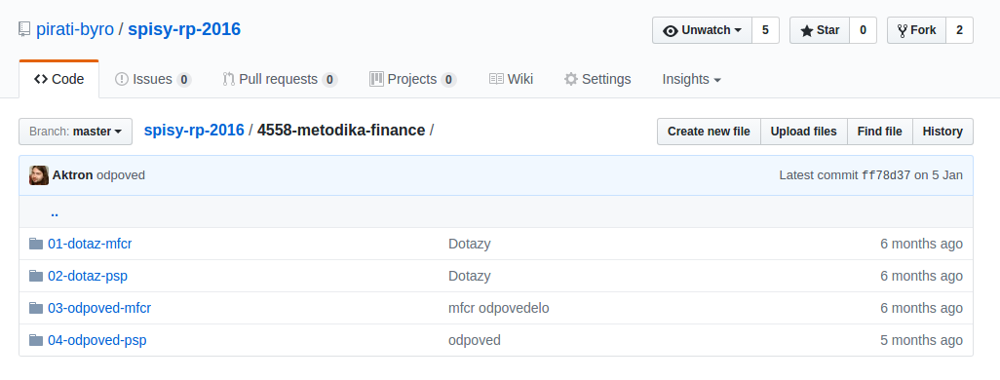
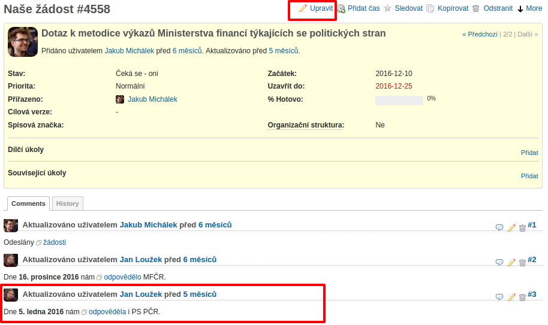

# Zakládání dokumentů do spisové služby

## Obsah

   * [Zakládání dokumentů do spisové služby](#zakládání-dokumentů-do-spisové-služby)
      * [1. Úvod](#1-Úvod)
      * [2. Zodpovědnost za nastavení tohoto procesu](#2-zodpovědnost-za-nastavení-tohoto-procesu)
      * [3. Definice procesu](#3-definice-procesu)
      * [4. Cíle procesu](#4-cíle-procesu)
      * [5. Manažer procesu a zodpovědnosti](#5-manažer-procesu-a-zodpovědnosti)
      * [6. Typické vstupy procesu](#6-typické-vstupy-procesu)
         * [6.1 Potřebné informace](#61-potřebné-informace)
         * [6.2 Potřebné zdroje](#62-potřebné-zdroje)
         * [6.3 Potřebný personál](#63-potřebný-personál)
         * [6.4 Potřebný výcvik](#64-potřebný-výcvik)
      * [7. Typické kroky během postupu](#7-typické-kroky-během-postupu)
         * [7.1 Posouzení režimu dokumentu](#71-posouzení-režimu-dokumentu)
         * [7.1 Nalezení spisu](#71-nalezení-spisu)
         * [7.2 Digitalizace papírového dokumentu](#72-digitalizace-papírového-dokumentu)
         * [7.3 Nahrání dokumentu do úložiště](#73-nahrání-dokumentu-do-úložiště)
         * [7.4 Určení termínu pro reakci](#74-určení-termínu-pro-reakci)
         * [7.5 Vložení poznámky do úkolovníku](#75-vložení-poznámky-do-úkolovníku)
         * [7.6 Zaúkolování zodpovědného člověka](#76-zaúkolování-zodpovědného-člověka)
         * [7.7 Vykázání času](#77-vykázání-času)
      * [8. Typický výstup procesu](#8-typický-výstup-procesu)
         * [8.1 Vytvořená informace](#81-vytvořená-informace)
      * [9. Rizika](#9-rizika)
         * [9.1 Nezaložení dokumentu](#91-nezaložení-dokumentu)
         * [9.2 Chybná data](#92-chybná-data)
      * [10. Související](#10-související)
         * [10.1 Procesy](#101-procesy)
         * [10.2 Právní podklad](#102-právní-podklad)
         * [10.3 Literatura](#103-literatura)

## 1. Úvod

1.  Tento dokument podrobně definuje proces zakládání dokumentů do spisů ve
    spisové službě.
2.  Založení dokumentu do spisové služby předchází jednak tvorba dokumentů a
    jednak [založení spisu].

## 2. Zodpovědnost za nastavení tohoto procesu

* Tento proces zdokumentoval Jakub Michálek.
* Dokument schválil dne .... vedoucí administrativního odboru Martin Kučera.

## 3. Definice procesu

Účelem zakládání dokumentů do spisové služby v listinné i elektronické
podobě je, abychom

* zamezili ztrátě jeho originálu,
* zajistili autenticitu elektronické podoby,
* zrychlili sdílení dokumentu mezi lidmi v organizaci a
* usnadnili orientaci ve věci spisu a tedy zastupitelnost a audit a
* usnadnili pozdější vyhledání dokumentu.

## 4. Cíle procesu

1.  **Cílem** tohoto procesu je, aby byl

    * každý dokument je řádně založen do spisové služby,
    * byla o něm dostatečně a prokazatelně informována osoba, která ho má vyřídit,
    * byly nastaveny termíny pro jeho vyřízení, které lze hlídat.

2.  **Ukazatele výkonu** v tomto procesu jsou:

    * počet administrativních pochybení, který je průběžně sledován vedoucím a
      řešen výtkou, snížením odměny a v případě hromadění pochybení změnou referenta,
    * průměrná doba věnovaná spisové službě v daném měsíci, která je zohledněna
      v měsíčním hodnocení práce referenta spisové služby.

3.  **Administrativní pochybení** je zjištění vady, která má negativní vliv
    na chod organizace. Opakující pochybení znamená, že je proces špatně
    vykonáván. Příklady administrativních pochybení („ápéček“):

    * chybí založený dokument, když ho potřebujeme,
    * prošvihneme termín na odvolání kvůli chybnému nastavení termínu,
    * příslušný člověk není informován o tom, že má něco řešit.

## 5. Manažer procesu a zodpovědnosti

1.  Manažerem tohoto procesu je administrativní odbor
    ([§ 12 odst. 2 písm. e) organizačního řádu][or]).
2.  Každý člen organizace, který obdrží dokument podléhající spisové službě,
    je zodpovědný za jeho založení do spisové služby; může tak učinit sám
    či prostřednictvím administrativní podpory.
3.  Za založení dokumentu má zodpovědnost referent spisové služby. Pro tento
    účel má pravomoc využívat nastavená oprávnění v informačním systému.
4.  Za včasnou reakci, hlídání lhůt a postup odpovídá člověk, kterému je daný spis přiřazen v úkolovníku. Ten se může domluvit s referentem na hlídání termínů.
5.  Metodickou podporu ke spisové službě poskytuje na základní úrovni Jan Loužek, zveřejňovač klubu Pirátů v Zastupitelstvu hl. m. Prahy, na vyšší úrovni Jakub Michálek, místopředseda strany.

[or]: https://wiki.pirati.cz/rules/or#administrativni_odbor

## 6. Typické vstupy procesu

### 6.1 Potřebné informace

* příchozí dokument do datové schránky, poštovní schránky, případně
  v odůvodněných případech e-mailové pošty, nebo
* odchozí dokument ve formátu PDF.

### 6.2 Potřebné zdroje

* přístupová oprávnění do **úložiště souborů** = spisového repozitáře na githubu, viz ([seznam spisových repozitářů][spisy]); každý tým má svůj vlastní repozitář pojmenovaný podle jeho zkratky a v případě velkého objemu dokumentů i roku,
* přístupová oprávnění do **úkolovníku** = projektu na [redmine](https://redmine.pirati.cz/projects/),
* přístup do datové schránky nebo e-mailové schránky, pokud z ní dokument přebíráte,
* o přístupová oprávnění požádejte vedoucího, oprávněnou osobu nebo technický odbor,
* skener nebo fotoaparát, pokud převádíte papírový dokument do PDF.

### 6.3 Potřebný personál

Referent spisové služby

### 6.4 Potřebný výcvik

Referent spisové služby musí být zaškolen

* k práci se soubory a verzemi v gitu a na githubu,
* k zakládání a upravování úkolů redmine,
* k provozu spisové služby podle tohoto návodu (viz níže o podpoře procesu).

[spisy]: https://github.com/pirati-byro?q=spisy

## 7. Typické kroky během postupu

* Přijde mi dokument k založení do spisové služby.

### 7.1 Posouzení režimu dokumentu

Podle tohoto postupu se nepostupuje a je třeba použít zvláštní postup, pokud se v dané věci nezakládá spis, viz [postup pro zakládání spisů][postup-spisy].

### 7.1 Nalezení spisu

* Související spis najdu vždy v repozitáři nebo projektu toho týmu, kterého se spis týká.

* Pokud je to náš **odchozí dokument**, vždy by v něm měla být uvedena naše spisová značka
(např. RP #2343), tedy spis je potřeba zakládat před tím, než vygeneruji
odchozí dokument do PDF, viz [postup pro založení spisu][postup-spisy].
Stačí v podstatě založit před vygenerováním dokumentu úkol v redmine.
To by měl vědět každý, kdo takové dokumenty generuje, protože jinak nebude
v reakcích našich partnerů spisová značka a spisy se nám budou hůře zakládat.

* Pokud jde o **příchozí dokument**, zjistím nejprve, zda již v dané věci
existuje spis. Spis existuje, pokud jsme již v dané věci někomu něco
posílali nebo oni již něco posílali nám. Poznám to například tak, že
v příchozím dokumentu reagují na nějaký náš odeslaný dokument a uvádějí
naši spisovou značku (např. RP #2343), nebo si zkusím vyhledat věc
v redmine podle klíčových slov. Pokud spis neexistuje (tj. jde o první
příchozí dokument v dané věci, např. nějaké upozornění ze strany úřadů),
založím spis podle [postupu pro založení spisu][postup-spisy].

[postup-spisy]: zakladani-spisu.md

### 7.2 Digitalizace papírového dokumentu

* Pokud je příchozí dokument papírový, referent (pokud možno) na jeho horní část zaznamená, kdy byl doručen a číslo spisu, kterého se týká (pro tento účel lze poučít i razítko).

* Takto označený dokument referent naskenuje nebo vyfotí a převede do formátu PDF; body 7.2 a následující se týkají pouze elektronické podoby dokumentu.

* Papírovou podobu založí do papírového spisu, který je uložen v papírové spisové službě daného týmu, typicky v jeho skříni, viz [postupu pro založení spisu][postup-spisy].

### 7.3 Nahrání dokumentu do úložiště

* Nyní tedy již mám číslo spisu, kterého se dokument týká.

* Zakládaný dokument nahraju
pomocí gitu do repozitáře daného týmu na githubu, viz [seznam spisových repozitářů][spisy].

* Dokument je třeba nahrát do podsložky daného spisu, která je nazvána podle

  * čísla úkolu a věci ve spisu, např. ``4558-metodika-finance/`` a dále
  * podle pořadového čísla dokumentu v daném spisu, např. ``04-odpoved-psp`` (viz obrázek).

* Pořadové číslo dokumentu
se uvádí s uvozovacími nulami vždy na 2 cifry, aby se dokumenty správně řadily.

* Pokud má referent pochybnost, zda je v zájmu strany nebo v souladu se
zákonem určitou věc zveřejnit, zeptá se vedoucího týmu nebo jeho zástupce,
případně použije soukromou poznámku či vloží spis do soukromého úložiště.

### 7.4 Určení termínu pro reakci

* Pro určení termínu pro uzavření je podstatné
datum, kdy nám byl dokument doručen nebo byl odeslán (podle údajů v datové
schránce nebo vyzvednutí na poště).

* Datum doručení nebo
odeslání a výpočet lhůty je potřeba průkazně zaznamenat. Datum doručení je určeno [pravidly pro doručování](http://www.mvcr.cz/clanek/obcane-tretich-zemi-prubeh-rizeni-prijimani-a-dorucovani-pisemnosti.aspx). Na správné určení data doručení je potřeba
si dát velký pozor, protože právě od něho se lhůty odvíjejí.

Lhůta je určena věcí, o kterou jde, a typicky vyplývá ze zákona nebo ze standardního obchodního styku. Vypočtěte tedy den lhůty,
do kdy je třeba spisu věnovat pozornost:

* V případě **příchozího dokumentu** je termínem pro reakci například den, do kdy je třeba
podat odvolání v 15denní lhůtě podle poučení v příchozím dokumentu,

* v případě **odchozího dokumentu** je termínem pro reakci den, kdy uplyne
úřadu zákonná nebo jiná přiměřená lhůta (plus případně několik dní k dobru),
a kdy tedy bude případně nutné urgovat vyřízení naší žádosti, pokud
nedostaneme žádnou odpověď (např. podat stížnost kvůli nečinnosti).

### 7.5 Vložení poznámky do úkolovníku

* Nyní je potřeba vložit poznámku o založeném dokumentu do příslušného úkolu
na [redmine](https://redmine.pirati.cz).

* Najděte si příslušný úkol na redmine podle čísla (zde je to
úkol 4558) a klikněte na tlačítko ``Upravit`` v horní liště.

* Přidejte také hypertextový odkaz na
konkrétní dokument v úložišti (pokud možno rovnou na náhled příslušného
pdf dokumentu). Tento hypertextový odkaz najdete přímo po rozkliknutí
struktury souborů ve spisovém repozitáři.

* Napište do textového pole
poznámku, kdy byl dokument doručen nebo odeslán, co a kdy je potřeba udělat, tj. termín pro reakci (viz obrázek níže).

* Lhůta se zároveň nastaví do pole
  ``Uzavřít do`` u daného úkolu.

 

### 7.6 Zaúkolování zodpovědného člověka

Pokud věc vyřizuje někdo jiný než referent, informuje referent tohoto člověka
o tom, že byl založen dokument a jak a do kdy je třeba reagovat či rozhodnout
o dalším postupu. Referent zejména dostatečnou dobu před termínem pro reakce
tohoto člověka a udělá všechny následující věci:

* kontaktuje osobně či telefonicky s vysvětlením úkolu a termínem,
* dále mu zašle e-mail, kde bude v příloze nebo pod odkazem založený dokument, a
* přiřadí zodpovědného člověka do pole ``Přiřazeno`` u daného úkolu v úkolovníku.

Doporučený postup je vyřizovat došlé věci obratem, kdykoliv je to v našem
zájmu, nikoliv až na konci lhůty.

### 7.7 Vykázání času

Práce se spisovkou se vykazuje jako administrativa pod sběrným úkolem
    spisová služba, viz [přehled spisových služeb][prehled-ss].

[prehled-ss]: https://redmine.pirati.cz/issues?utf8=%E2%9C%93&set_filter=1&f%5B%5D=status_id&op%5Bstatus_id%5D=o&f%5B%5D=subject&op%5Bsubject%5D=~&v%5Bsubject%5D%5B%5D=spisov%C3%A1+slu%C5%BEba&f%5B%5D=&c%5B%5D=project&c%5B%5D=subject&c%5B%5D=assigned_to&group_by=&t%5B%5D=

## 8. Typický výstup procesu

### 8.1 Vytvořená informace

* Založený (odeslaný či přijatý) dokument v systému,
* založený úkol v úkolovníku a nastavený termín pro reakci v dané věci,
* prokazatelně informovaná osoba, která má dokument vyřídit.

## 9. Rizika

### 9.1 Nezaložení dokumentu

* Riziko je středně pravděpodobné a může být vážné, protože dokument nebude dohledatelný v okamžiku, kdy ho potřeba.
* Ke zmírnění rizika slouží jednotný a centrální systém zakládání dokumentů v rámci daného týmu, dobrý výcvik referentů spisové služby a informovanost všech lidí o povinnosti zakládat podstatné dokumenty do spisové služby (např. zastupitelů, hospodářů apod.).

### 9.2 Chybná data

* Riziko chybného založení termínu či chybný výpočet lhůty je středně pravděpodobné a může být vážné, pokud prošvihneme lhůtu pro důležité odvolání nebo stížnost.
* Ke zmírnění rizika je potřeba, aby se referent spisové služby dobře soustředil během výpočtu lhůty, aby byl náležitě poučen o pravidlech stanovení okamžiku doručení, určení lhůt z platných předpisů a výpočtu hmotněprávních a procesněprávních lhůt. Proto je třeba složitější výpočty lhůty zdokumentovat.

## 10. Související

### 10.1 Procesy

* [Zakládání spisu][postup-spisy]
* Přiřazení spisové značky
* Zadávání úkolů

### 10.2 Právní podklad

* Politická strana má povinnost uchovávat dokumenty a umožnit výběr
archiválií podle [§ 3 odst. 2 písm. b) zákona č. 499/2004 Sb. o archivnictví a spisové službě](https://www.zakonyprolidi.cz/cs/2004-499#p3-2-b).
* Zmocňovací ustanovení pro administrativní odbor je v organizačním řádu
    ([§ 12 odst. 2 písm. e) organizačního řádu][or]).

### 10.3 Literatura

Ludmila Sulitková: [Archivnictví a spisová služba](http://ff.ujep.cz/archivnictvi/spisova_sluzba.pdf). FF UJEP.
