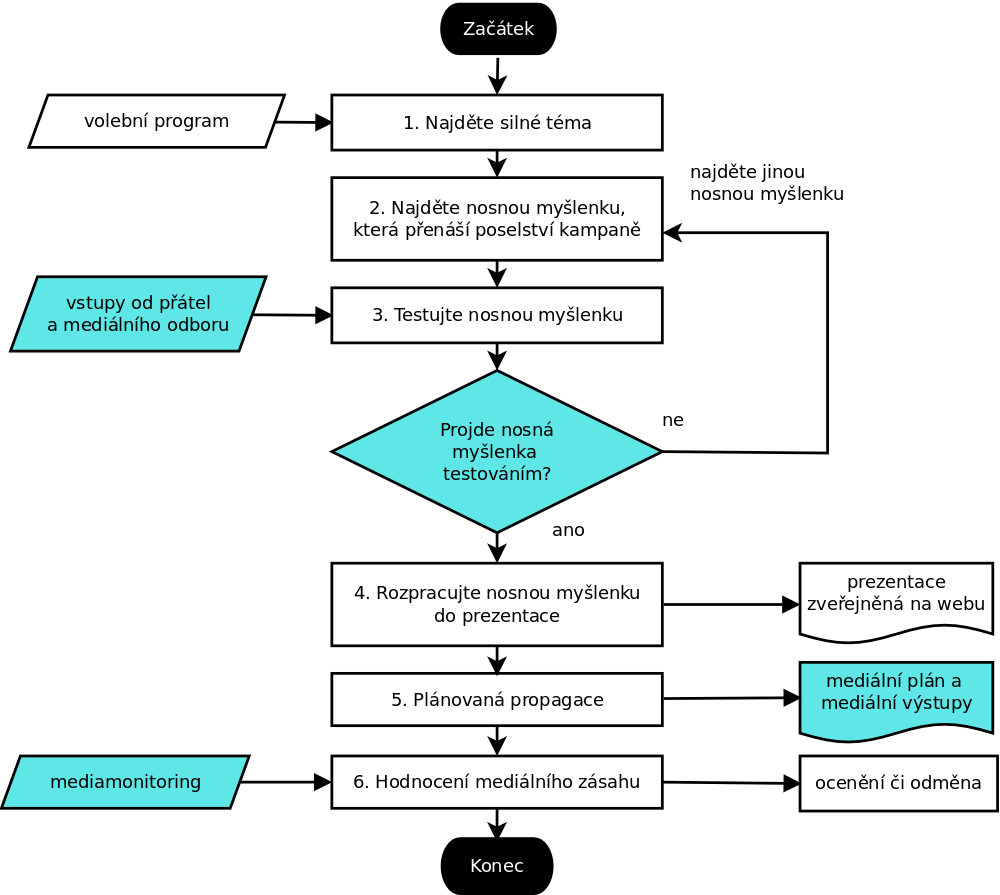

# Propagace tématu

## Úvod

* Tento dokument podrobně definuje proces propagace určitého tématu, přípravy
  a medializace výstupů,
  zejména programových témat v průběhu volební kampaně, na kterých se podílejí
  garanti volebního programu, členové republikového předsednictva a kandidáti (zejména lídři).

* V této fázi již skutečně není potřeba produkovat programové dokumenty,
  nýbrž **maximálně šířit informace o našem programu včetně poselství mezi voliče**.

* Proces přípravy a medializace výstupů navazuje na samotnou tvorbu programu.

## Zodpovědnost za nastavení tohoto procesu

* Tento proces zdokumentoval Jakub Michálek.
* Dokument schválil dne .... vedoucí mediálního odboru Mikuláš Ferjenčík.

## Definice procesu

* Účelem propagace tématu je seznámit voliče s naším programem,
  vzbudit u něho zájem, identifikaci s Piráty a ideálně v konečném důsledku
  a kontextu celé kampaně i nadšení pro nás hlasovat v dalších volbách.
* V rámci propagace si v mediální prostoru vymezujeme pozici, která musí být
  čitelná. K tomu slouží mimo jiné poselství kampaně a kontrast s oponenty.
* Nosnou myšlenku byste měli nalézt za jedno odpoledne, jeden den vám bude trvat tvorba prezentace, jeden den mediální plán a zbylých několik desítek hodin strávíte tvorbou a šířením mediálních výstupů podle plánu a reakcemi na aktuální podněty.

## Cíle procesu

**Cílem** tohoto procesu je, aby volič získal jednoduchou základní informaci
o našem programu, která  

* ho zaujme,
* vzbudí u něj zájem o další informace o Pirátech a
* zapojí se do celké skládačky v rámci kampaně.

Je třeba zejména být vidět v mediálním prostoru a vyvarovat se mediálních průserů.   

## Měření výkonnosti

**Ukazatele výkonu** v tomto procesu jsou:

* počet a velikost mediálních zásahů daného výstupu,
* rychlost reakce na mediální událost,
* počet a velikost mediálních průserů, který je průběžně sledován vedoucím a
  řešen výtkou, snížením odměny a v případě hromadění pochybení změnou referenta.

**Mediálním zásahem** rozumíme počet voličů v cílové skupině, který je osloven
daným mediálním výstupem. Mediální zásahy hodnotíme podle velikosti média
a rozsahu mediálního výstupu. Jako pozitivní jsou hodnoceny pouze ty mediální zásahy,
které nejsou mediální průser. Zajímají nás pouze relevantní mediální výstupy,
které zasáhnou určitý nadkritický počet lidí:

* **Drobný** mediální zásah = cca 10 000 diváků, výstup středně navštěvovaném
  či odborném serveru (ale aspoň evidovaný na [google news][gn]), vystoupení v časopisech s malým nákladem, v málo sledovaných
  rozhlasových pořadech či stanicích,
* **Střední** mediální zásah = cca 50 000 diváků, výstup na na velkém zpravodajském portálu
  (novinky.cz, idnes.cz, seznam.cz), na malé televizi (např. TV Barrandov),
  v radiu (Impuls, ČRo), regionální mutaci televize (Události v regionech)
  nebo v tištěném tisku celostátního významu (Blesk, MF DNES, Právo, )
* **Velký** mediální zásah = cca 500 000 diváků, např. vystoupení na velké
  televizi (ČT, Nova, Prima) v hlavním vysílacím čase; příkladem je vystoupení
  v Otázkách Václava Moravce,
* **Zásadní** mediální zásah = nastolení hlavního tématu dne nebo týdne ve všech
  výše uvedených médiích

Mediální zásah lze také velmi dobře měřit v monitoringu.

[gn]: http://news.google.cz

**Rychlost reakce** je počet minut či hodin, ve kterých dokážeme
po zveřejnění určité události (např. výstupu konkurenční strany) dostat naše sdělení k novinářům. Ideální je současnost (např. vystoupení či přítomnost na stejné tiskové konferenci) anebo předčasnost, tj. dodání informace novinářům předem.

**Mediálním průserem** je mediální výstup, který stranu poškozuje.
Velikost mediálního průseru je hodnocena stejně jako u mediálního zásahu.
Jde např. o

* extrémně nesrozumitelné vysvětlení programu či usvědčení ze lhaní či neodbornosti, porušování
  programu či jiného zavrženíhodného programu anebo zatloukání,
* prohlášení názoru, který je v rozporu s programem strany a je jí v důsledku
  toho mylně připisován (např. vystoupení z NATO)
* nepřijatelné vystupování mluvčího (opilost, špatné oblečení).

## Manažer procesu a zodpovědnosti

* Manažerem tohoto procesu je **mediální odbor**
  ([§ 11 odst. 2 písm. a) organizačního řádu][or]).
* Každý **garant programového bodu** je povinen sledovat svěřenou oblast,
  přípravovat návrhy stanovisek strany k projednávaným návrhům zákonů či
  jiným opatřením a informovat veřejnost o aktuálním dění a názorech Pirátů
  ([§ 17 organizačního řádu][or2]).
* Přesné rozdělení působnosti mezi garanty je v [kompetenčním zákoně][kz] a
  vyplývá také z našeho [volebního programu][program].
* Garanti by kolem sebe měli utvořit **odborný tým**, který jim bude pomáhat plnit dané
  úkoly. Každý člen a příznivec je vítán, aby se do činnosti týmu zapojil nebo
  aby se jako tahoun ujal určitého tématu. Od garanta se očekává, že bude
  tahoun aspoň v jednom tématu ve svěřené oblasti.
* Metodickou podporu k medializaci poskytují na základní úrovni
  Jakub Dušánek a Roman Kučera, psavci,
  na vyšší úrovni Mikuláš Ferjenčík, vedoucí mediálního odboru.
* Pokud máte návrhy na zlepšení tohoto procesu nebo jeho podprocesů, kontaktujte
  metodickou podporu nebo manažera tohoto procesu.

[or]: https://wiki.pirati.cz/rules/or#medialni_odbor
[or2]: https://wiki.pirati.cz/rules/or#garant_programove_oblasti
[kz]: https://www.zakonyprolidi.cz/cs/1969-2
[program]: https://www.pirati.cz/program/psp2017.html
[jmi]:  https://praha.pirati.cz/lide/jakub-michalek/
[jlouzek]: https://praha.pirati.cz/lide/jan-louzek/

## Typické vstupy procesu

### Potřebné zdroje

* schválený [program nebo programová východiska](https://www.pirati.cz/program/),

* garant programu, který vytváří podklady pro medializaci a má základní povědomí
  o poselství kampaně a způsobech medializace,

* zdroje mediálního odboru:

  * kontakty na novináře (zejména v oblasti své odbornosti),
  * přístup ke správě celostátního facebooku,
  * přístup na hlavní web Pirátů,
  * možnost publikace na blogu.

## Typický postup

Níže uvedený postup není potřeba do puntíku dodržet, nicméně může vám
pomoci dosáhnout maximální efektivity při medializaci tématu.

### 1. Najít silné téma

* předně z programu vyberte **jedno konkrétní silné téma**, které budete zpracovávat
* typicky si představte, že byste byli pozváni do televize a ta vás požádala, abyste v dané oblasti popsali během 3 minut jednu věc, co chcete zlepšit
* anebo ne, nepředstavujte si to, ale prostě si to tak **vyzkoušejte**, dokud nebude vás ústní přednes dostatečně přesvědčivý (z počátku může být opakování otravné, ale když si uvedomíte, že opakování je podstatou propagace, tak vás to už nebude trápit)
* příklad dostatečně konkrétního tématu: Zdanění práce zaměstnanců (= proč stát ukousne tolik peněz z našich daní, proč je vše tak složité apod.)
* téma musí být dostatečně zajímavé, aby zaujalo velkou část populace (naší cílové skupiny) a dostatečně překvapivé a zajímavé, abychom o něm mohli mluvit a profilovat se na něm, to z něj právě dělá silné téma
* ve volebním programu je hlavním tématem zpravidla první nadpis v programu pro dané ministerstvo
* je lepší kvalitně zpracovat a zmedializovat jedno téma než nekvalitně zpracovat více témat; proto téma vyberte skutečně důkladně, protože na medializaci jiných témat vám už možná čas nezbude

### 2. Najít nosnou myšlenku, která přenáší poselství kampaně

* pro dobrou prezentaci je třeba mít **jednu hlavní nosnou myšlenku**, příklad pro oblast daní: Skutečně rovná daň z práce zaměstnanců, která sníží zdanění práce z 48,6 % na 47 %.
* vstupem pro identifikaci nosné myšlenky vám budou rešerše statistických a jiných faktických údajů, rozhovory s experty, rozhovory s aspoň 5 běžnými občany o daném tématu a dosavadní mediální výstupy (nejen Pirátů) k danému tématu,
* v jednoduché prezentaci nosné myšlenky vám pomůže, pokud si ji můžete namalovat (například náš bublinový diagram níže) a případně si ji jednoduše osahat [www.pirati.cz/kalkulacka][kalkulacka]

![Jednoduché daně][bubliny]

* dobré nosné myšlenky jsou: jednoduché, nečekané, konkrétní, uvěřitelné, emocionální a příběhové (viz [zde][success])
* musíme se zejména vyhnout prokletí znalostí, tedy tomu, že my tématu rozumíme, zatímco čtenář se s ním třeba nikdy nesetkal, žádné knihy nečetl a potřebuje to velmi jednoduše pochopit a věřit tomu na základní úrovni
* nosná myšlenka bude důvěryhodnější, pokud se bude **vázat k vašemu životnímu příběhu** (například člověk, který vyrostl v Polsku může vyprávět o tom, jak se v Polsku stavějí dálnice rychleji než v ČR)

![Sticky ideas][sticky]

[bubliny]: https://www.pirati.cz/assets/img/program/k01_jedna_sazba.png
[kalkulacka]: http://www.pirati.cz/kalkulacka
[sticky]: http://brandgenetics.com/wp-content/uploads/2014/03/mts-made-to-stick-model-1024x791.png
[success]: http://brandgenetics.com/made-to-stick-why-some-ideas-survive-and-others-die-speed-summary/

Nosná myšlenka musí **přenášet poselství celé kampaně**

* Poselství volební kampaně zní jednoduše tak, že dnešní politici se neobejdou bez miliardářů a lobbistů a na lidi kašlou a překvapivě **Piráti jsou teď ta jediná nová síla, která má šanci se letos dostat do Parlamentu, přinést tam s čerstvé nápady a něco tam změnit**. Buď se tam letos dostanou Piráti nebo zůstane vše při starém. Takže: Pusťte nás na ně! Z poselství kampaně vyplývají 4 základní okruhy témat: kontrola moci a mocných, zjednodušit stát pomocí technologií, NE šikanování občanů, obrana svobody.
* Všechna témata musí být **naroubována na toto poselství**. Například výše uvedený nápad se zjednodušením daní lze jistě označit za čerstvý, který myslí na lidi a zjednodušuje byrokracii revolučním způsobem. Zatímco ČSSD šokuje tím, jak je její systém nevýhodný pro vyšší střední třídu, Piráti šokují jednoduchostí. Navíc návrh Pirátů adekvátně zdaní i ty miliardáře, kterým až dosud politické strany umožňovaly danit nižší sazbou.

### 3. Testování nosné myšlenky

* Jakmile budete mít promyšlenou hlavní myšlenku, je potřeba ji **otestovat**.
* Vyberte si aspoň 2 nebo 3 lidi kolem sebe a hlavní myšlenku jim řekněte a diskutujte
  s nimi o ní. Po diskusi se jich zeptejte, zda jim téma přijde zajímavé a zda by se podle něj
  rozhodovali, koho volit nebo zda jít k volbám.   
* Pokud nosná myšlenka prošla testem mezi vašimi blízkými, **kontaktujte mediální**
  **odbor** telefonem a zkuste mu předneste tuto nosnou myšlenku. Zástupce mediálního
  odboru posoudí, zda myšlenka zapadá do konceptu kampaně, rozhodne, zda a jak
  se má zpracovat a dá vám další instrukce.

### 4. Rozpracování nosné myšlenky do prezentace

* Rozpracování nosné myšlenky spočívá jednak v jejím dobrém zabalení a jednak
  zasazení do souvislostí.
* Jednoduchou nosnou myšlenku je třeba komunikovat v jednom jednoduchém balení,
  které bude poutavé pro všechny typy lidí (vizuální, verbální, dějové).
* Dobře zpracovaná nosná myšlenka navázaná na poselství typicky půjde shrnout
  do jednoho obrázku, do jednoho příběhu a do jednoho bonmotu. Tyto prvky
  tvoří jednotnou reprezentaci nosné myšlenky a je dobré je opakovaně používat
  během volební kampaně.
* K zasazení do souvislostí slouží velmi dobře prezentace, která spojuje
  všechny tři komunikační typy.
* Vaším úkolem je dodat špičkovou prezentaci. Držte se [pravidla 10/20/30][gkrule]. Příklad použití prezentace při vysvětlování programu je na [webu markeťáka Martina Jaroše](http://www.nehnuti.cz/digitalni-zeme/).
  Podívejte se také na naše prezentace k daním, které najdete v [složce tohoto návodu][home].
* Prezentace
  musí mít tu **správnou délku** a musí být optimalizována tak, aby si standardně
  rozumný člověk po jejím shlédnutí řekl: „To je dobré, ty Piráti tomu rozumí
  a vlastně by bylo docela hustý je mít ve sněmovně”.
* Velikost
  této prezentace (rozpracování) nesmí být moc velká, aby to člověk pochopil
  na první dobrou (tj. maximálně 10 snímků prezentace). Zároveň ale nesmí být
  moc krátká, aby nám nikdo nemohl vytknout, že přehlížíme základní souvislosti
  problému.

[gkrule]: https://guykawasaki.com/the_102030_rule/
[home]: ./files/prezentace/

### 5. Plánovaná propagace

* Jakmile bude nosná myšlenka zpracována do prezentace, je třeba začít pracovat na mediálním plánu a získávání podpory (koalice) pro dané téma.
* Plánování je všechno, plán je nic. Plán nechte stručný a buďte kdykoliv připraveni na jeho aktualizaci. Při plánování se **vyvarujte megalomanie**, abyste zakládali obrovské, nesplnitelné a nepřehledné množství položek v plánu. Lepší jednu věc medializovat pořádně, než více věcí lajdácky.  
* Zásadní chystané věci prosím předejte mediálnímu odboru do mediálního plánu. Mediální plán najdete na adrese [media.jdem.cz](http://media.jdem.cz), ovšem přístup je vzhledem k citlivosti omezen na konkrétní osoby. Každá plánovaná věc je v plánu na jednom řádku (viz šablony v [adresáři][adr]). Plán zašlete mediálnímu odboru.
* Nezapomeňte, že hlavní pravidlo médií je neustále opakovat to samé, aby to voliči vůbec zaznamenali. Pouze tak docílíte toho, že to daný člověk uslyší vícekrát.

Seznam aktivit, které lze využít při propagaci tématu:

* Sepište si všechny **lidi, zájmové skupiny a spolky** (opinion makery), tyto lidi osobně, telefonicky nebo e-mailem oslovte. Není
  nutné hned získat jejich souhlas, někdy stačí pouze věcně informovat o tom, že tu jsme a co děláme a že
  si naopak vážíme toho, co dělají oni, případně jim nabídnout setkání či je požádat o sdílení informaci s jejich členy. Zamyslete se u každé zájmové skupiny, která má přirozený zájem na námi prosazovaném opatření, čím by mohla být nápomocna při propagaci.
* Sepište si všechny **akce, chystané události** apod., které souvisí s vaší nosnou myšlenkou (například s myšlenkou daní souvisí den daňové svobody v červnu, se školstvím souvisí první školní den). Mediální událostí je v tomto případě vše, o čem píšou noviny, a tedy mohou to být i návrhy vašich oponentů, které můžete kritizovat (je dobré vědět, co se připravuje). Pokud náš soupeř plánuje nějakou tiskovou konferenci, je dobré tam zajít a nabídnout novinářům i jiný, kritický pohled (novináři se hodí pro vyvážený článek oba názory).
* Naplánujte si, kdy a jak **odstartujete svojí prezentaci**. Tím se prezentace dostane do veřejného dění. Usilujeme, aby dopad startovací prezentace byl co největší, typicky se k tomu používá tisková konference nebo tisková zpráva. Termín a způsob projednejte s mediálním odborem.
* Na startovací prezentaci musí navazovat **další domluvená medializace** – domluvené individuální rozhovory s novináři, sdílení statusů, obrázků z prezentace a fotografií z akcí na celostátním facebooku a na individuálních faceboocích, na blogu. Pokud jde o ožehavé téma a nechcete se spálit, napište místo stanoviska strany citaci předsedy, některého místopředsedy strany nebo vedoucího mediálního odboru.

[adr]: ./files/medialni_plan/

### 6. Vyhodnocení mediálního zásahu

Po proběhnutí všech akcí celou propagaci tématu vyhodnoťte (viz část
hodnocení výkonnosti výše).

## Typický výstup procesu

* Mediální výstupy (články v médiích na internetu, v tisku, reportáže v televizích,
  v rozhlase apod.)

## Rizika

### Mediální průser

* Riziko je málo pravděpodobné, ale může být vážné, protože významně poškodí
  důvěryhodnost strany.
* Ke zmírnění rizika slouží důkladná příprava a plánování, předběžná kontrola
  ze strany mediálního odboru, pokud jde o významnější věci.

### Pomalá reakce na mediální výstup

* Riziko je velmi pravděpodobné, ale spíše méně závažné, protože znamená pouze
  nevyužití potenciálu.
* Ke zmírnění rizika slouží služby okamžitých zpráv na mobil zodpovědným osobám
  a pracovní postup pro operativní reakce na aktuální události.

## Související

### Procesy

* [Napsání tiskové zprávy][tz]
* [Rozesílání tiskových zpráv][rozeslattz]

[tz]:  http://www.malamarketingova.cz/pruvodcetiskovouzpravou.html
[rozeslattz]: http://www.malamarketingova.cz/tiskovazpravadomedii.html

### Právní podklad

* Zmocňovací ustanovení pro mediální odbor je v organizačním řádu
  ([§ 11 odst. 2 písm. a) organizačního řádu][or]).

### Literatura

Ludmila Sulitková: [Archivnictví a spisová služba](http://ff.ujep.cz/archivnictvi/spisova_sluzba.pdf). FF UJEP.
